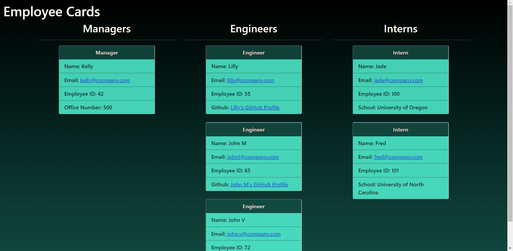

# Team Profile Generator

## UofO Coding Bootcamp Homework for Week 10

### The function of this app is to be able to enter your team members and have it render a website that looks like the example below. 
**Note: When you use this for yourself, you must delete the html file that is already there since that is only an example** 
### A live example can be accessed [here.](https://reidk361.github.io/Homework-Week-10-Team-Profile-Generator/)
### A video showing how this works is [here.](https://drive.google.com/file/d/15jexVxaVd5Rb2Yqbk9PPzchsPUA1e85_/view)

> **1920p width screen example.**   

> **Note: Appearance will change based on screen resolution.** 

